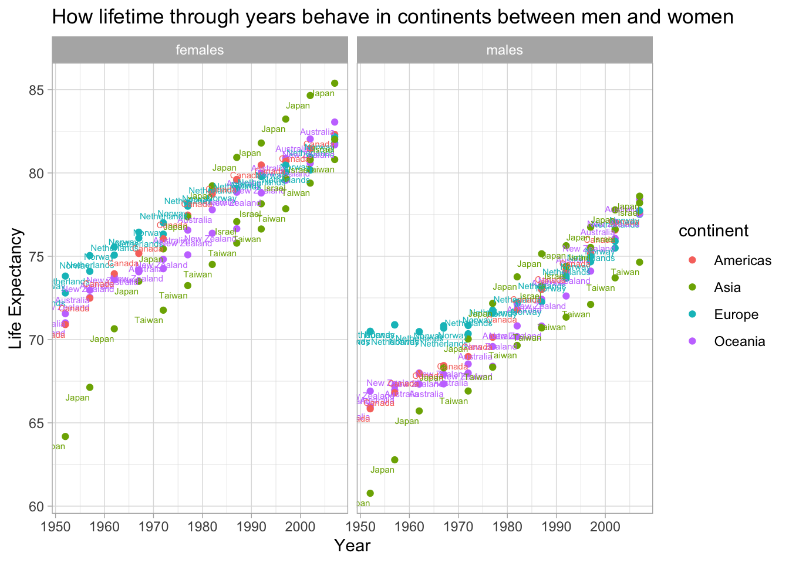

# (PART) Personal Projects {.unnumbered}

# Life Expectancy {.unnumbered}

## Datasets {.unnumbered}


### The Information Table {.unnumbered}

First, we shall need to create an information table to observe *(1) the countries*, *(2) the HTTPS link access to the* **mortality.org** *for each country dataset* and *(3) the range of years accordingly*. This would be much more helpful along the way whenever we encounter the index or the time being of the datasets.


```r
# Information table
inform=data.frame(country=c("Australia", "Finland", "Latvia", "Slovenia", "Austria", "France", "Lithuania", "Spain", "Belarus", "Germany", "Luxembourg", "Sweden", "Belgium", "Greece", "Netherlands", "Switzerland", "Bulgaria", "Hong Kong", "New Zealand", "Taiwan", "Canada", "Hungary", "Norway", "U.K.", "Chile", "Iceland", "Poland", "U.S.A.", "Croatia", "Ireland", "Portugal", "Ukraine", "Czechia", "Israel", "Republic of Korea", "Denmark", "Italy", "Russia", "Estonia", "Japan", "Slovakia"),
                  http=paste(rep("https://www.mortality.org",41),GET("https://www.mortality.org") %>% read_html() %>% html_nodes(xpath='//*[@id = "countries_table"]/tr/td/p/a') %>%                            html_attr('href'),sep=""),
                  years=rep(0,41))

# A function to extract years for each dataset
get_years=function(http){
  get=GET(http)
  html <- read_html(get)
  year=html %>% html_nodes(xpath='//p[contains(text(),"Life tables")]/../../../tr[12]/td[2]/p') %>% html_text(trim=TRUE)
  return(year)
}

# Adding years to information table. 
inform$years[1:41]=sapply(inform$http[1:24],get_years,USE.NAMES = FALSE)
```


```r
glimpse(inform)
```

```
#> Rows: 41
#> Columns: 3
#> $ country <chr> "Australia", "Finland", "Latvia", "Slovenia", "Austria", "Fran…
#> $ http    <chr> "https://www.mortality.org/cgi-bin/hmd/country.php?cntr=AUS&le…
#> $ years   <chr> "1921  - 2019", "1878  - 2020", "1959  - 2019", "1983  - 2019"…
```

### Scraping the Data {.unnumbered}

Note that using Rstudio Cloud yields much a quicker result! At this point, we shall have all the HTTPS and xpath to collect all of 40 datasets and store it in the *full_df* variable. This is a time-consuming step since we are having the conversation with a dataframe containing more than 800 thousand entries. Function data_set is constructed with the idea that:  

1. Create the HTTPS connection to each country data using the xpath from **mortality.org** homepage.  
2. Use the *read_table* function with the *content* argument to import txt file into R. Since **mortality.org** requires a personal account for downloading any data provided, we shall need to input the account in the *authenticate* argument.  
3. Filter needed columns.  


```r
# A function to scrape data from the website. 
data_set=function(i,gender){
  print(paste("Successfully scrape ",i,":",inform$country[i]))
  if(gender=='females'){
    data=read_table(content(GET(paste(rep("https://www.mortality.org"),GET(inform$http[i]) %>% read_html() %>% html_nodes(xpath='//p[contains(text(),"Life tables")]/../../../tr[13]/td[3]/div/a') %>% html_attr("href"),sep=""),authenticate(user="dattran.hcmiu@gmail.com", password="1632536609", type = "basic"))),col_names = FALSE)
  } else {
    data=read_table(content(GET(paste(rep("https://www.mortality.org"),GET(inform$http[i]) %>% read_html() %>% html_nodes(xpath='//p[contains(text(),"Life tables")]/../../../tr[14]/td[3]/div/a') %>% html_attr("href"),sep=""),authenticate(user="dattran.hcmiu@gmail.com", password="1632536609", type = "basic"))),col_names = FALSE)
  }
  data_3=data[3:nrow(data),1:7]
  colnames(data_3)=c("year", "Age", "mx", "qx", "ax", "lx", "dx")
  data_3$country=inform$country[i]
  data_3
}
# A loop to combine 2*40 data tables
table_combine=function(data_gender,gender){
  for(i in 1:40){
    new_data_gender=data.frame(data_gender[i])
    if(i==1){
      full_data_gender=new_data_gender
    } else{
      full_data_gender=rbind(full_data_gender,new_data_gender)
    }
  }
  if(gender=="females"){
    full_data_gender=full_data_gender %>% mutate(gender="females")
  } else{
    full_data_gender=full_data_gender %>% mutate(gender="males")
  }
}
# Big data
# Error for 25:Chile data still haven't been explained so we only apply the scrape data function for 40 numbers
full_df=rbind(table_combine(lapply(c(1:24,26:41),data_set,"females"),"females"),table_combine(lapply(c(1:24,26:41),data_set,"males"),"males"))
# Transform datatype to numeric
full_df=transform(full_df,Age=as.numeric(Age),qx=as.numeric(qx),lx=as.numeric(lx),year=as.numeric(year))
```

```r
glimpse(full_df)
```

```
#> Rows: 816,516
#> Columns: 9
#> $ year    <dbl> 1921, 1921, 1921, 1921, 1921, 1921, 1921, 1921, 1921, 1921, 19…
#> $ Age     <dbl> 0, 1, 2, 3, 4, 5, 6, 7, 8, 9, 10, 11, 12, 13, 14, 15, 16, 17, …
#> $ mx      <chr> "0.05999", "0.01206", "0.00578", "0.00289", "0.00325", "0.0025…
#> $ qx      <dbl> 0.05750, 0.01199, 0.00576, 0.00288, 0.00325, 0.00251, 0.00248,…
#> $ ax      <chr> "0.28", "0.50", "0.50", "0.50", "0.50", "0.50", "0.50", "0.50"…
#> $ lx      <dbl> 100000, 94250, 93120, 92583, 92316, 92016, 91785, 91557, 91391…
#> $ dx      <chr> "5750", "1130", "537", "267", "300", "231", "228", "166", "126…
#> $ country <chr> "Australia", "Australia", "Australia", "Australia", "Australia…
#> $ gender  <chr> "females", "females", "females", "females", "females", "female…
```

## USA Insights {.unnumbered}

### Mortality rates {.unnumbered}

The following codes compare mortality rates across the ages ranging from zero to one hundred and ten. 

```r
# Filter USA, 2019. line: qx~Age by gender
ggplot(full_df %>% 
         filter(country=="U.S.A.",
                year==2019), 
       aes(x=Age, y=qx,group=1)) +
geom_line(col="red") +
labs(x="Age x", 
     y= expression(paste("Mortality rate ", 
                         q[x])),
     title="Mortality rates (U.S.A., 2019)") +
facet_wrap(~gender)
```


The look is similar to the graph of an exponential function so it is suggested that taking logarithm and we may have further insights.

```r
# Filter USA, 2019. line: log(qx)~Age by gender
ggplot(full_df %>% 
         filter(country=="U.S.A.",
                year==2019), 
       aes(x=Age, y=log(qx),group=1)) +
geom_line(col="red") +
labs(x="Age x", 
     y= expression(paste("Log Mortality rate ", 
                         q[x])),
     title="Log Mortality rates (U.S.A., 2019)") +
facet_wrap(~gender)
```


A glance at this log mortality graph indicates three important features of the evolution of mortality rates:

1. The rate for infants is locally high for the newborns, then it decreases.  
2. It shows an upward hiccup around the age of eighteen. This is called the accident hump. The accident hump is often caused by increased fatalities from car accidents and is (usually more pronounced) in males compared to females.  
3. And then it straightens back again, reflecting the human aging process.  

### Survival probablity {.unnumbered}

It is convenient to illustrate this section using examples. We calculate the 5-year survival probability of an 18-year-old. First extract px as 1 minus qx stored in the life table. We need the survival probability of an 18-year old until a 22-year-old. We then multiply these one-year survival probabilities to get the 5-year survival probability. Using the prod() function on the vector of relevant one-year survival probabilities gives you the result.
$${}_{k}p_{x}=p_x.p_{x+1}...p_{x+k-1}$$
Alternatively, we could evaluate this probability as the division of the number of alive people $l_x$ in different ages. Up to rounding errors, both calculations lead to the same result!
$${}_{k}p_{x}=\frac{l_{x+k}}{l_{x}}$$

```r
# Filter USA,2019, Age>=18
# Add column survival
# line: survival~1:92 (18-110) by gender
ggplot(full_df %>% 
         filter(country=="U.S.A.",
                year==2019,
                Age>=18) %>% 
         group_by(gender) %>% 
         mutate(survival=cumprod(1-qx),
                k=0:(n()-1)) %>% 
         ungroup(),
       aes(x=k,y=survival)) +
geom_line(col="red") +
labs(x="k", 
     y=expression(paste(""[k], "p"[18])),
     title="Survival probabilities for people 
            in age 18, 2019, U.S.A.") +
facet_wrap(~gender)
```


This graph indicates the probability of how many more years people would still be alive after the age of eighteen, for example, the chance of an eighteen girl to survive more fifty years up to sixty-eight years old should be about ninety percent.

### Life expectancy {.unnumbered}

Let's start from the future lifetime, $K_x$, that is the number of whole years lived by (x). The probability that Kx takes value k is the probability that an x-year-old survives k years and then dies within the next year, at age x+k. Further manipulation shows that this probability is the difference between the k and the (k+1)-year survival probability of an x-year-old. 
$$P(K_x=k)={}_{k}p_{x}.q_{x+k}={}_{k}p_{x}-{}_{k+1}p_{x}$$
We can verify this equivalence empirically for the example of an 18-year-old. What is his 5-year deferred mortality probability? In the first expression you apply the reasoning with the 5-year survival probability and the mortality rate at age 23, while the second expression takes the difference between the 5- and the 6-year survival probability. Both expressions lead to the same result!

$${}_{k}p_{x}.q_{x+k}$$

$${}_{k}p_{x}-{}_{k+1}p_{x}$$

Using the probability function of $K_x$, it is now straightforward to calculate the expected value of this random variable. That is the life expectancy of an x-year-old, expressed in whole years. For each possible outcome k, you multiply k with the probability that $K_x$ realizes this outcome. Taking the sum then results in the life expectancy. Further simplification leads to a simple expression: the sum of the k-year survival probabilities when k runs from 1 to its maximum possible value.

$$E[K_x]= \sum_{k=0}^{\infty} k \times P(K_x=k) = \sum_{k=0}^{\infty} k \times ({}_{k}p_{x}-{}_{k+1}p_{x}) =  \sum_{k=1}^{\infty}{}_{k}p_{x}$$

```r
# Function to compute the curtate expected future lifetime for a given age and life table
curtate_future_lifetime <- function(age, life_table) {
  px <- 1-life_table$qx
  kpx <- cumprod(px[(age+1):length(px)])
  sum(kpx)
}

# Vector of ages
ages <- (full_df %>% 
           filter(country=="U.S.A.",
                  year==2019,
                  gender=="females") %>% 
           mutate(Age=replace_na(Age,110)))$Age

# Curtate future lifetimes for all ages
future_lifetimes <- sapply(ages, 
                           curtate_future_lifetime, 
                           full_df %>% 
                             filter(country=="U.S.A.",
                                    year==2019,
                                    gender=="females") %>% 
                             mutate(Age=replace_na(Age,110)))


# Future lifetime by age
plot(ages, 
     future_lifetimes, 
     type = 'l', 
     lwd = 2, 
     col = "green", 
     xlab = "Age x", 
     ylab = "Future lifetime", 
     main = "Future lifetime by age, females, 2019, U.S.A.")
```


So it’s quite intuitive that women in the USA live up to 80 years old, and for each more age they live the expected value decreases by 1 forming the linear pattern from zero to eighty, after which we see the extreme cases following just a small little tail.

```r
# Filter USA. line qx~Age by gender, color by year
ggplot(full_df %>% 
         filter(country == "U.S.A."), 
       aes(x=Age, y=qx, color = year)) +
geom_line(aes(group = year)) + 
facet_wrap(~gender) +
labs(x="Age x", 
     y= expression(paste("Mortality rate ", q[x])),
     title="Mortality rates (USA, 1933-2019)")
```


Adding another dimension year to the plot with the attribute color, it is obvious to say as the years proceeded, the mortality rate has been stably improved and thus firmly decreased.
We could try to compare the lifetime across the year between males and females:

```r
# Filter USA. 
# Add column life_expectancy
# line: life_expectancy~year, color by gender
ggplot(full_df %>% 
         filter(country == "U.S.A.") %>% 
         group_by(gender,year) %>% 
         mutate(kpx=cumprod(1-qx),
                life_expectancy=sum(kpx)) %>% 
         filter(Age==0) , 
       aes(x=year, y = life_expectancy, color = gender)) +
geom_line() + 
labs(x="Year", 
     y= "Life Expectancy",
     title="Life Expectancy, U.S.A.")
```


It is evident to suggest that women outlived, outlive and will outlive men.

## Big Data {.unnumbered}

### The general looks {.unnumbered}


```r
# Add column life_expectancy. 
# Filter Age=0, interesting countries
# scatter:life_expectancy~year color by country by gender
ggplot(full_df %>%
         group_by(year,country,gender) %>% 
         mutate(Age=replace_na(Age,110),
                kpx=cumprod(1-qx),
                life_expectancy=sum(kpx)) %>% 
                filter(Age==0) %>% 
                ungroup(),
       aes(x=year,y=life_expectancy,color=country)) + 
geom_point() +
facet_wrap(~gender) +
ggtitle("Lifetime through years in 40 countries between men and women") +
  xlab("Year") + ylab("Life Expectancy")
```


This colorful scatter plot summarizes how the data of 800.000 entries behave when it comes to life duration among top-ranking countries across the years. This may be overwhelming but this gives the strongest evidence for developing lifetime as years going by. What’s more, while the maximum (point of) males is just higher than eighty, that of females converges to the age of ninety just for the next few years.


```r
# Add column life_expectancy
# Filter Age=0, interesting countries
# life_expectancy~year, color by gender by country
ggplot(full_df %>% 
         filter(country %in% c("Australia", 
                               "Canada", 
                               "Hong Kong", 
                               "Israel", 
                               "Japan", 
                               "Netherlands", 
                               "New Zealand", 
                               "Norway", 
                               "Republic of Korea", 
                               "Taiwan", 
                               "U.K.", 
                               "U.S.A.")) %>% 
         group_by(gender,year) %>% 
         mutate(kpx=cumprod(1-qx),
                life_expectancy=sum(kpx)) %>% 
         filter(Age==0), 
       aes(x=year, y = life_expectancy, color = gender)) +
geom_line() + 
facet_wrap(~country) +
ggtitle("Comparing women and men lifetime through years between 12 countries") +
  xlab("Year") + ylab("Life Expectancy")
```


We can use line graph to compares the expectation of life for both sexes. Filter only countries of interest and split the data across the countries using is another way to view the data and the years available accordingly. Korea and Sweden have the smallest and the biggest dataset respectively. 

### Big Data joining Gapminder {.unnumbered}


```r
df_gapminder = full_df %>% 
       inner_join(gapminder,by=c("year","country")) %>% 
       group_by(year,country,gender) %>% 
       mutate(Age=replace_na(Age,110),
              kpx=cumprod(1-qx),
              life_expectancy=sum(kpx)) %>% 
       filter(Age==0) %>% 
       ungroup() %>%
       filter(country %in% c("Australia", 
                               "Canada", 
                               "Hong Kong", 
                               "Israel", 
                               "Japan", 
                               "Netherlands", 
                               "New Zealand", 
                               "Norway", 
                               "Republic of Korea", 
                               "Taiwan", 
                               "U.K.", 
                               "U.S.A."))

ggplot(df_gapminder,
       aes(x=year,y=life_expectancy,color=continent)) + 
geom_point() +
facet_wrap(~gender) +
geom_text(aes(label=country),hjust=1, vjust=2,size=2) +
ggtitle("How lifetime through years behave in continents between men and women") +
  xlab("Year") + ylab("Life Expectancy")
```


It’s obvious to spot that the top 1 winner is Asia with 2 recurring champions Hong Kong and Japan and all of the other rich countries.


Turning interests to 2007, let's use available information in gapminder to conduct some analysis:

```r
# Scatter:gdpPercap~life_expectancy, 2007 color by continent by gender
ggplot(full_df %>% 
         inner_join(gapminder,by=c("year","country")) %>% 
         filter(country %in% c("Australia", 
                               "Canada", 
                               "Hong Kong", 
                               "Israel", 
                               "Japan", 
                               "Netherlands", 
                               "New Zealand", 
                               "Norway", 
                               "Republic of Korea", 
                               "Taiwan", 
                               "U.K.", 
                               "U.S.A."),year==2007) %>%
         group_by(year,country,gender) %>% 
         mutate(Age=replace_na(Age,110),
                kpx=cumprod(1-qx),
                life_expectancy=sum(kpx)) %>% 
         filter(Age==0) %>% 
         ungroup() %>%
         group_by(year,gender) %>%
         arrange(desc(life_expectancy)),
       aes(x=gdpPercap,y=life_expectancy,color=continent,size=pop)) + 
geom_point() +
facet_wrap(~gender) +
geom_text(aes(label=country),hjust=1, vjust=1,size=2) + 
  ggtitle("How lifetime, and GDP per Capital behave between men and women") +
  xlab("Year") + ylab("Life Expectancy")
```


Although the USA was superior with respect to the GDP per capita, the large population resulting from a whole lot of immigrants dragged the life expectancy down the road. So let's verify this assumption by viewing the data over the course of 12 5-year from 1952. However, we have to leave 1 dimension for the variable year to come in. Since the graph of women and men behave in a pretty similar way, we could take females and observe the consistent result.

```r
# Scatter:gdpPercap~life_expectancy, color by continent 
# Females, by years
ggplot(full_df %>% 
         inner_join(gapminder,by=c("year","country")) %>% 
         filter(country %in% c("Australia", 
                               "Canada", 
                               "Hong Kong", 
                               "Israel", 
                               "Japan", 
                               "Netherlands", 
                               "New Zealand", 
                               "Norway", 
                               "Republic of Korea", 
                               "Taiwan", 
                               "U.K.", 
                               "U.S.A."),gender=="females") %>%
         group_by(year,country,gender) %>% 
         mutate(Age=replace_na(Age,110),
                kpx=cumprod(1-qx),
                life_expectancy=sum(kpx)) %>% 
         filter(Age==0) %>% 
         ungroup() %>%
         group_by(year,gender) %>%
         arrange(desc(life_expectancy)),
       aes(x=gdpPercap,y=life_expectancy,color=continent,size=pop)) + 
geom_point() +
facet_wrap(~year) +
geom_text(aes(label=country),hjust=1, vjust=1,size=2) +
ggtitle("How population, GDP per Capital and lifetime behave through years") +
  xlab("GDP per Capita") + ylab("Life Expectancy")
```


